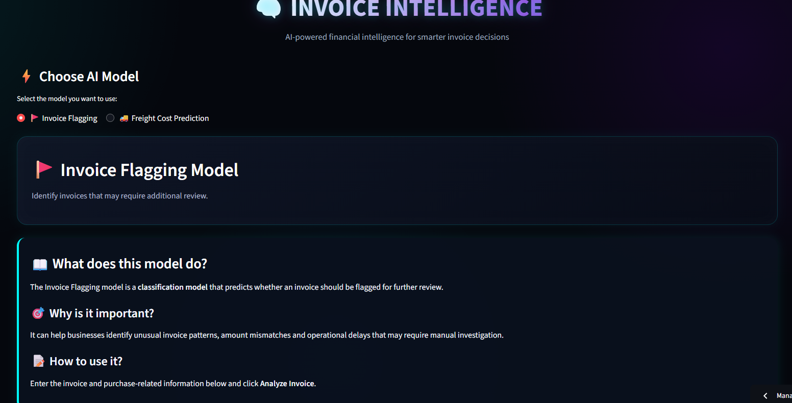
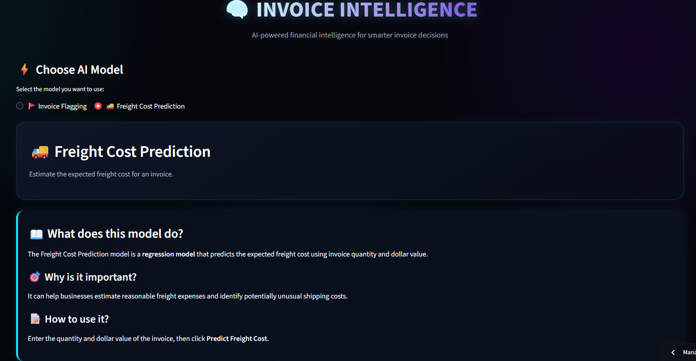
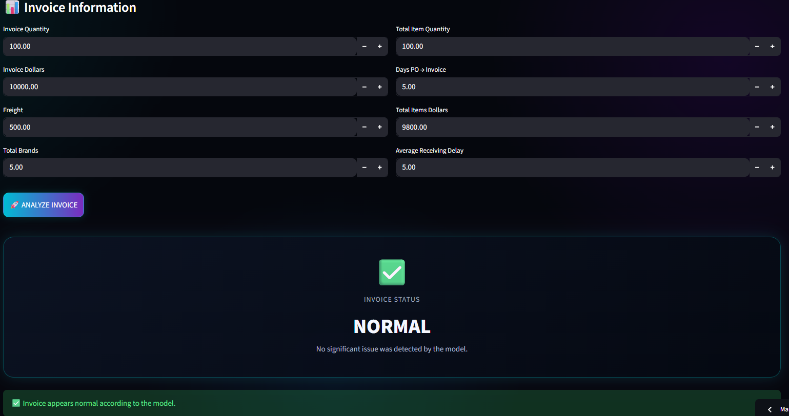
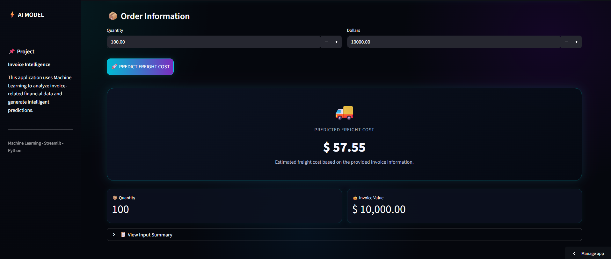

# 🧾 Invoice Intelligence

**Invoice Intelligence** is a Machine Learning-based application designed to analyze invoice data, identify potentially risky invoices, and predict freight costs using historical business data.

🔗 **[Invoice-Intelligence-Live-Project](https://invoice-intelligence-ml-project-princebuildsai.streamlit.app/)**

## 🖼️ Project Preview

<table align="center">
  <tr>
    <td style="border: 2px solid #00aaff; border-radius: 12px; padding: 6px; box-shadow: 0 0 15px #00aaff;">
      
    </td>
    <td style="border: 2px solid #00aaff; border-radius: 12px; padding: 6px; box-shadow: 0 0 15px #00aaff;">
      
    </td>
  </tr>
  <tr>
    <td style="border: 2px solid #00aaff; border-radius: 12px; padding: 6px; box-shadow: 0 0 15px #00aaff;">
      
    </td>
    <td style="border: 2px solid #00aaff; border-radius: 12px; padding: 6px; box-shadow: 0 0 15px #00aaff;">
      
    </td>
  </tr>
</table>

---

## 🚀 Key Features
🚀 **Trained on 5,000+ invoice records to deliver data-driven risk detection and freight cost predictions.**
* 🚩 **Invoice Risk Flagging** — identifies invoices that may require further review.
* 🚚 **Freight Cost Prediction** — estimates expected freight cost from invoice information.
* 🤖 **2 Machine Learning Models** — classification + regression.
* 📊 **8 Invoice Features** used for risk analysis.
* 🗄️ **SQLite Database** for structured business data.
* 🌐 **Streamlit Web Application** for interactive predictions.
* ⚡ **Real-time predictions** through a simple user interface.

---

## 🧠 Machine Learning

### 1. 🚩 Invoice Flagging

**Goal:** Identify potentially problematic invoices.

**Features:**

1. Invoice Quantity
2. Invoice Dollars
3. Freight
4. Total Brands
5. Total Items Quantity
6. Days PO to Invoice
7. Total Items Dollars
8. Average Receiving Delay

**Model:** Random Forest Classifier

**Output:**

* `0` → Normal Invoice
* `1` → Flagged Invoice

---

### 2. 🚚 Freight Cost Prediction

**Goal:** Predict expected freight cost using invoice information.

**Features:**

1. Quantity
2. Dollars

**Target:**

* Freight Cost

**Models evaluated:**

1. Linear Regression
2. Decision Tree Regression
3. Random Forest Regression

The model with the **lowest MAE** is selected and saved for prediction.

---

## 🛠️ Tech Stack

| Technology      | Purpose              |
| --------------- | -------------------- |
| 🐍 Python       | Core development     |
| 🐼 Pandas       | Data processing      |
| 🔢 NumPy        | Numerical operations |
| 🤖 Scikit-learn | Machine Learning     |
| 💾 SQLite       | Database             |
| 📦 Joblib       | Model serialization  |
| 🌐 Streamlit    | Web application      |


## 📊 Project Workflow

```text
SQLite Database
       ↓
Data Extraction
       ↓
Data Preprocessing
       ↓
Feature Selection
       ↓
Model Training
       ↓
Model Evaluation
       ↓
Best Model Selection
       ↓
Streamlit Application
       ↓
Real-Time Prediction
```

---

## 📈 Model Evaluation

### Invoice Flagging

* Classification model: **Random Forest**
* Feature scaling: **StandardScaler**
* Evaluation based on classification performance

### Freight Prediction

* **3 regression models** evaluated
* Selection metric: **MAE**
* Best-performing model saved as `.pkl`

---

## ⚙️ Installation

### 1. Clone the repository

```bash
git clone https://github.com/your-username/invoice-intelligence-ml-project.git
```

### 2. Move into the project

```bash
cd invoice-intelligence-ml-project
```

### 3. Install dependencies

```bash
pip install -r requirements.txt
```

### 4. Run the application

```bash
streamlit run app.py
```

---

## 🎯 Project Impact

1. Automates invoice risk identification.
2. Reduces manual invoice review effort.
3. Provides data-driven freight cost estimates.
4. Combines multiple ML techniques in one application.
5. Converts historical business data into actionable predictions.

---

## 🌐 Deployment

The application is built with **Streamlit** and can be deployed as an interactive web application for easy access and demonstration.

---

## 🔮 Future Improvements

1. Add advanced anomaly detection.
2. Improve model performance with hyperparameter tuning.
3. Add interactive analytics dashboards.
4. Introduce explainable AI for invoice risk predictions.
5. Add automated model monitoring.

---

## 👨‍💻 Author
PRINCE SINGH
**Machine Learning / AI Engineering Project**

Built to demonstrate practical application of **Machine Learning, Data Processing, Model Evaluation, and Deployment** in a business-focused use case.
